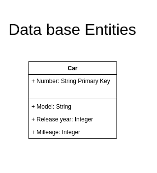
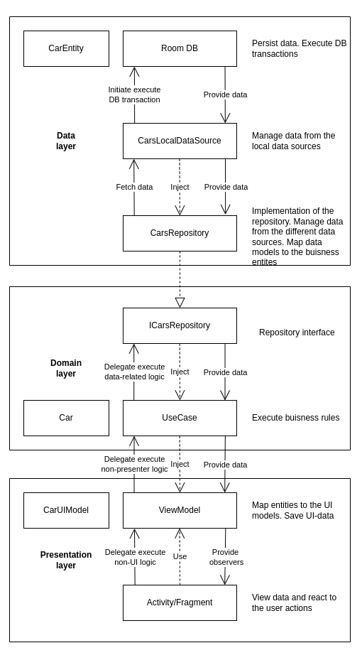

# Тестовое задание для Surf IT
Техническое задание представлено в [документе](./documents/Android%20Kotlin%20Test%20Task%201.pdf).

## Описание приложения:
Одноэкранное приложение с возможностями:
- Просмотра списка имеющихся автомобилей;
- Сортировки этого списка по регистрационному номеру, модели, коду региона и по стране
регистрации;
- Поиску автомобиля по регистрационному номеру;

## Архитектура приложения
Приложение работает с одной сущностью - автомобилем:  
  
Для приложения изначально была разработана диаграмма возможных прецендентов (Use-Case диаграмма):  
  
Приложение построено согласно принципам
[чистой архитектуры](https://fernandocejas.com/2018/05/07/architecting-android-reloaded/):  
  

## Стек используемых технологий и подходов:
- Android Framework;
- Библиотеки Android Jetpack: AppCompat, Fragment-ktx, Lifecycle-ktx;
- Язык программирования: Kotlin 1.8.22;
- Система сборки: Gradle 8.0;
- Дизайн: Material You;
- Для DI: Hilt;
- Для асинхронной работы: Kotlin Coroutines и Kotlin Flow;
- Для работы с локальной БД: Room
- Методология разработки git-flow;

## Тестирование работоспособности приложения:
Тестирование производилось на эмуляторе устройства Pixel с Android 5.0 (API 21):  
  
